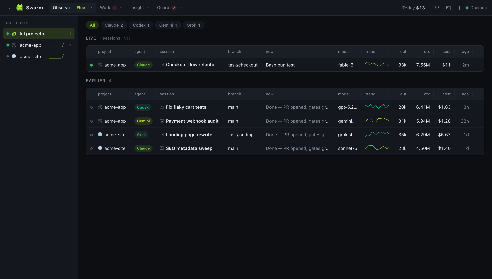
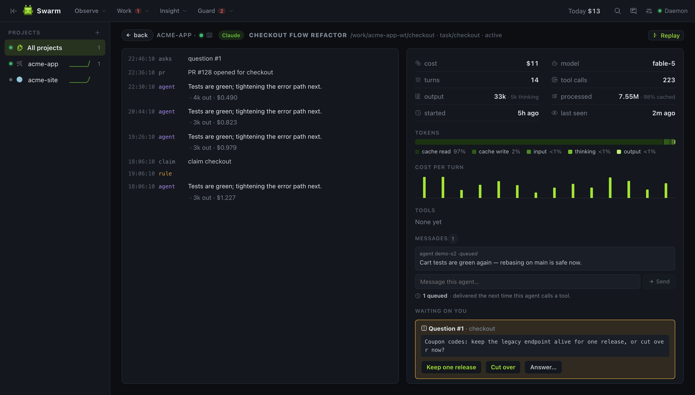
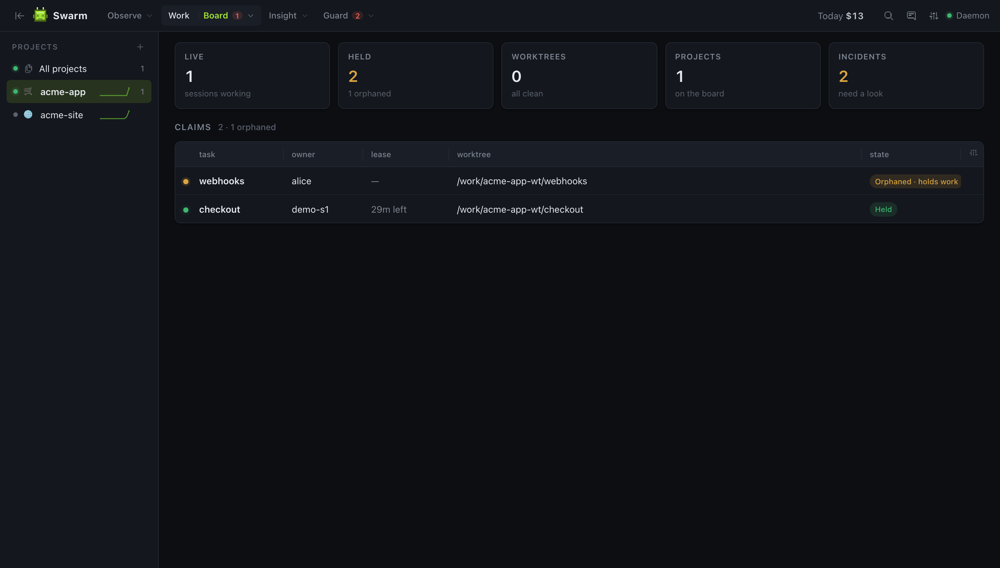
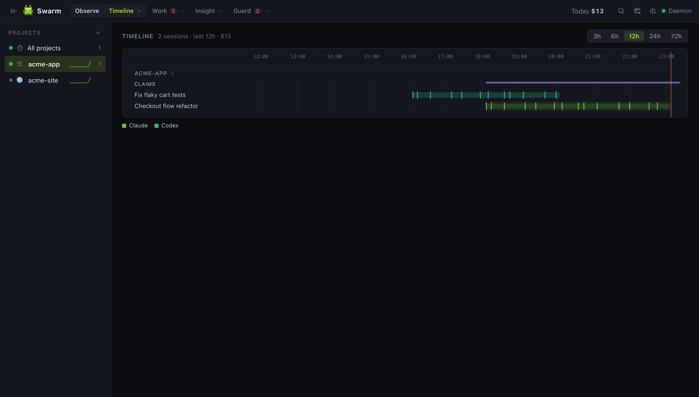
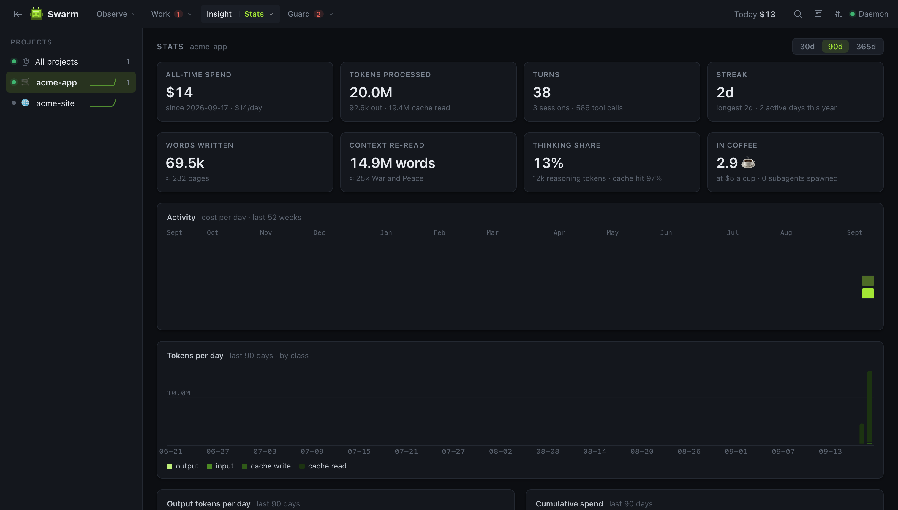

<p align="center"></p>

<h1 align="center">Swarm</h1>

<p align="center"><b>See every agent. Stop the collisions.</b><br>
A local-first control plane for AI-agent development on any repository.</p>

<p align="center">
  <a href="https://getswarm.vercel.app">Website</a> ·
  <a href="https://getswarm.vercel.app/docs/">Docs</a> ·
  <a href="https://getswarm.vercel.app/#downloads">Downloads</a> ·
  <a href="https://getswarm.vercel.app/changelog">Changelog</a> ·
  <a href="https://github.com/ra3orblade/swarm/issues/new?template=feedback.yml">Feedback</a>
</p>

<p align="center">
  <a href="https://github.com/ra3orblade/swarm/releases/latest"></a>
  <a href="https://www.npmjs.com/package/@ra3orblade/swarm"></a>
  <a href="https://github.com/ra3orblade/swarm/actions/workflows/ci.yml"></a>
  <a href="https://github.com/ra3orblade/swarm/releases"></a>
  <a href="https://www.npmjs.com/package/@ra3orblade/swarm"></a>
  <a href="LICENSE"></a>
</p>

<p align="center"><a href="https://getswarm.vercel.app"></a></p>

Run more than one [Claude Code](https://claude.com/claude-code) session at a time — or a [Codex CLI](https://github.com/openai/codex) or Grok run on the side — and you lose the thread fast: which session is on which branch, what it's costing, which worktree has uncommitted work nobody owns, why that edit got blocked. Swarm is one daemon that watches every session on your machine — live tool calls, reasoning, token spend, cost — keeps a ledger of who holds which task, worktree and runtime resource, turns the "never do X" prose in `CLAUDE.md` into real permission decisions, and streams all of it to one dashboard.

It runs entirely on your machine. No account, no telemetry, works offline. Nothing is added to your repositories.

```sh
bunx @ra3orblade/swarm setup
```

> Status: early, but real — observability, task claims in isolated worktrees, runtime resources, configurable rules, incidents, a cross-forge merge queue, spawned agents (`swarm run` / `swarm dispatch`), executed verification gates, handoffs, session replay, search and spend budgets are built and dogfooded daily — Swarm dispatches its own tasks. Agent-to-agent messaging, declarative workflows and a built-in review gate are next on the [roadmap](ROADMAP.md).

---

## What you get

**Fleet** — every session across every project, live: agent, title, branch, what it's doing right now, model, a trend sparkline, output tokens, context size, cost, age. Filter by agent (Claude Code, Codex, Grok).

**Session** — an agent's reasoning and tool calls as a live stream, with cost per turn, cache hit rate, thinking share, tool histogram and the transcript path. **Replay** steps through its tool calls one at a time with full input and output; an ended session gets **Resume where it died**, which spawns a run from what it left behind; a session inside a worktree shows its **Diff**.

<p align="center"></p>

**Board** — the coordination ledger for a project: **tasks** from your backlog (a markdown file, GitHub Issues or Linear) with a ✓ / ✗ per gate and **Run** / **Dispatch** actions, task **claims** (each in an isolated git worktree), **worktrees** with branch, drift, dirty/unpushed state and which session is inside — plus **Diff**, **PR** (push + open a pull/merge request prefilled from the task and handoff), **Open** and **Remove** per row — **runtime resources** (ports, dev servers, databases held as named singletons), **dispatch** status, recent **gates**, and **incidents** — every command the rules asked about or denied, with the rule and the command, and a **Codify** action that turns one into a `.swarm.toml` rule and a `CLAUDE.md` lesson.

<p align="center"></p>

**Rules** — guardrails on the Bash commands a Claude Code session runs: `shared_tree`, `destructive_git`, `pattern_kill`, `protected_ports`, plus `no_foreign_worktree` and the opt-in `claim_required_to_write` on file writes; each `ask | deny | off` per repo in `.swarm.toml`. A `deny` is returned to Claude Code as a real permission denial. Ports held as resources are protected automatically. Guardrails against accidents, not a sandbox — see [what rules are and aren't](https://getswarm.vercel.app/docs/03-rules-and-config#what-rules-are--and-arent).

**Run & Dispatch** — start an agent from Swarm: `swarm run --task X` (or **Run** on a task row) claims the task and spawns `claude -p` in its worktree; steer it by stdin, stop it by pid. Its permission prompts go through the same rules as your interactive sessions — `deny` auto-denies, `ask` becomes an **Allow / Deny** card on the session, nothing else blocks. `swarm dispatch --ready` hands every claimable task to its own run, N at a time; when a run ends Swarm re-runs the gates and looks for the PR, and reports done / gates-failed / no-pr / crashed. Run profiles (`full | no-edits | read-only`) narrow what a spawned agent may do.

**Gates & handoffs** — `.swarm.toml` declares the gates every task must pass; a gate with a `cmd` is executed in the task's worktree (exit 0 passes, the output tail is the evidence) — on demand, from the agent, or automatically when a session in a held worktree ends. The latest run decides, failed runs are never deleted. Every session that pauses leaves an auto-handoff (files edited, last verification command, last request); the next session in that worktree gets it, the lease left, gate status and held resources injected at start.

**Ask the human** — an agent that hits a decision only you can make calls `swarm_ask`; the question shows on the session page with the options as buttons, Fleet shows an **Asking** badge, a desktop notification fires, and the answer reaches the agent on its own.

**PRs** — one merge queue across GitHub and GitLab, read through your already-authenticated `gh` / `glab`. Merge from the dashboard when checks and review are clear. No tokens stored.

**Timeline** — session lanes per project, coloured by agent, 3–72 h.

<p align="center"></p>

**Spend & Stats** — cost by project, model, agent and **task**, today and all-time, with a context-budget table that ranks sessions by how much context they re-read; per-repo **budgets** (`daily` / `weekly` ceilings that warn, ask or stop); plus the fun numbers: tokens, turns, streaks, activity calendar, words written, what it adds up to in novels and coffee.

**Search** — full-text memory over everything Swarm remembers: handoffs, incidents, gate runs and what sessions said. **Dry-run rules** replays a project's history under rule modes you pick before switching anything on.

<p align="center"></p>

**Multi-agent** — Claude Code via its hooks and transcripts; Codex CLI and Grok by tailing the session logs they already write (`~/.codex`, ACP `updates.jsonl`). Every session is tagged with its agent; Spend breaks down per agent.

**Zero instrumentation** — it reads the hooks and transcripts the agents already write. Every table is a real data grid: sort, resize, reorder, filter, persisted layouts. Light and dark themes.

## Install

Requires [Bun](https://bun.sh) ≥ 1.3, git, and at least one agent: [Claude Code](https://claude.com/claude-code) (`claude` on your PATH — hooks, rules and MCP need it), [Codex CLI](https://github.com/openai/codex) and/or Grok (observed by tailing their logs; no hooks, so no rules). Optional: `gh` and/or `glab` (authenticated) for the PRs view.

```sh
bunx @ra3orblade/swarm setup        # daemon + hooks + MCP, opens the dashboard
```

Or install the CLI globally (`bun add -g @ra3orblade/swarm`, then `swarm setup`). Start `claude` in any folder and it appears at **http://127.0.0.1:7777**. The daemon runs in the background and auto-starts when needed; `swarm doctor` checks everything and prints the fix for each gap.

Prefer a native window with auto-updates? Get the **desktop app** from the [downloads page](https://getswarm.vercel.app/#downloads) — macOS (signed + notarized), Windows, Linux (`.deb` / `.rpm`). It bundles the daemon; run `bunx @ra3orblade/swarm install` once to add the Claude Code hooks. Building it yourself needs the Rust toolchain: `bun run desktop:dev` / `bun run desktop:build`.

Full guide: **[getswarm.vercel.app/docs](https://getswarm.vercel.app/docs/)** — [Getting started](https://getswarm.vercel.app/docs/01-getting-started) · [The dashboard](https://getswarm.vercel.app/docs/02-dashboard) · [Rules and configuration](https://getswarm.vercel.app/docs/03-rules-and-config) · [Claims and worktrees](https://getswarm.vercel.app/docs/04-claims-and-worktrees) · [Runtime resources](https://getswarm.vercel.app/docs/05-runtime-resources) · [Pull requests](https://getswarm.vercel.app/docs/06-pull-requests) · [CLI](https://getswarm.vercel.app/docs/07-cli) · [MCP](https://getswarm.vercel.app/docs/08-mcp) · [Desktop app](https://getswarm.vercel.app/docs/09-desktop-app) · [Privacy & FAQ](https://getswarm.vercel.app/docs/10-privacy-and-faq)

## Rules in 30 seconds

Drop a `.swarm.toml` in a repo (commit it — it's how the repo declares its rules). Global defaults live in `~/.swarm/config.toml`. Bad config never takes the daemon down.

```toml
[rules]                      # "ask" | "deny" | "off"
shared_tree     = "deny"     # broad `git add -A` / `commit -a` while another live session shares the checkout
destructive_git = "ask"      # reset --hard, checkout ., clean -f …
pattern_kill    = "ask"      # pkill -f and friends
protected_ports = "ask"      # freeing a port listed below (or held as a resource)
no_foreign_worktree     = "ask"  # file writes into a worktree another claim holds
claim_required_to_write = "off"  # opt-in: writes to the shared checkout need a claim

[rules.protected]
ports = [5432]

[gates]                      # what every task must pass; a gate with a cmd is executed, not vouched for
required = ["tests", "review"]
[gates.tests]
cmd = "bun test"

[worktree]                   # start every new worktree warm
copy  = [".env.local"]
setup = "bun install"

[tasks]                      # the backlog the Board, `swarm tasks` and dispatch read
source = "docs/plan.md"      # or "github" / "linear"

[budget]                     # USD ceilings; on_exceed = "warn" | "ask" | "stop"
daily = 25

[dispatch]
max_parallel = 2
```

Every `ask` and `deny` is recorded as an incident on the Board. Reference: [Rules and configuration](https://getswarm.vercel.app/docs/03-rules-and-config) · full [`docs/13-config.md`](docs/13-config.md).

## CLI

```sh
swarm setup                    # first-run: daemon + hooks + dashboard
swarm start | stop | restart   # manage the background daemon
swarm status                   # live sessions in the terminal
swarm doctor                   # check setup, print the fix for each gap
swarm add <path> · ls · ui     # pin a project · list projects · open the dashboard
swarm tail                     # follow the live event stream

swarm tasks [--ready]          # the repo's task source; --ready = claimable now
swarm claim <task> [--owner n] # claim a task in a fresh isolated worktree (fail-closed)
swarm renew | release <task>   # extend the lease · release + remove the worktree
swarm claims · reap            # list claims · release abandoned ones (keeps those holding work)
swarm handoff <task> --done "…" --remaining "…"   # leave notes for the next holder · resume <task> reads them
swarm gate run <task> [gate…]  # execute the repo's [gates.<name>] cmd gates in the worktree and record them
swarm gate record <task> <gate> pass|fail --rubric "…"   # record a verification run by hand · gate ls
swarm wt [ls|create|open|diff|rm|gc]   # first-class worktrees: task-less ones, drift, diff, collect stale
swarm pr open <task>           # push the branch and open a PR/MR prefilled from task, handoff, gates, files

swarm run --task <id> --prompt "…" [--profile no-edits|read-only]   # spawn claude -p in the task's worktree
swarm run ls | send <task> "…" | stop <task>   # steer (stdin) or stop a spawned run — by pid, never pattern
swarm run resume <session-id>  # pick up where a dead session stopped (its handoff + tail)
swarm dispatch --ready | <task…> · status · clear   # claim + spawn a run per task, max_parallel at a time
swarm questions · answer <id> <text>   # what agents are waiting on a human for

swarm res ls | acquire <name> [--pid n] [--port n] | release <name> [--force]
swarm serve start [--name web] -- <cmd>   # dev server: port allocated, PORT set, pid tracked, port protected
swarm proc start [--name n] -- <cmd>      # same, for workers without a port · serve/proc ls | stop
swarm stats [--json]           # all-time totals, streak, records
swarm search <query>           # memory over handoffs, incidents, gates, what sessions said
swarm rules dryrun [--set rule=mode,…]    # replay history under rule modes; shows what would fire

swarm install | uninstall      # add/remove Swarm hooks in ~/.claude/settings.json + the MCP server
```

## For agents (MCP)

`swarm setup` registers an MCP server with Claude Code (and with Codex CLI and Gemini CLI when installed), so an agent can coordinate itself instead of you running the CLI:

- `swarm_status` / `swarm_context` — what's claimed, who's live, what's held; what Swarm told this session at start, current as of now
- `swarm_next_task` / `swarm_claim` / `swarm_renew` / `swarm_release` / `swarm_reap` — the backlog and task claims in isolated worktrees (fail-closed)
- `swarm_handoff` / `swarm_resume` — leave notes for the next holder, read the last ones
- `swarm_gates` / `swarm_gate_run` / `swarm_gate_record` — see, execute or record verification gates
- `swarm_pr_open` — push the branch and open a PR/MR prefilled from the task and handoff
- `swarm_dispatch` — a lead agent hands ready tasks to autonomous runs in their own worktrees
- `swarm_ask` / `swarm_inbox` — ask the human a question (with options); the answer arrives on its own
- `swarm_acquire_resource` / `swarm_release_resource` / `swarm_resources` — hold a port, dev server or database as a named singleton; held ports are protected from other agents automatically
- `swarm_search` — memory over handoffs, incidents, gates and what sessions said

## How it works

```
 Claude Code sessions ──hooks──▶ swarm-hook ──┐
 (any folder, any repo)                          │
                        transcripts (JSONL) ──────┼──▶ swarmd ──▶ SQLite (~/.swarm)
 Codex CLI  ─── ~/.codex rollout logs ────────────┤      │
 Grok       ─── ACP updates.jsonl ────────────────┘      └──▶ SSE ──▶ dashboard · CLI · MCP
                                                  ▼               ▲
                                       rules engine (ask / deny → incidents)
                                       ledger: claims · worktrees · gates · handoffs · resources · budgets
                                                  │
                                       swarm run / dispatch ──▶ claude -p in a claimed worktree ──┘
```

- **Identity** is the git common dir, so every worktree of a repo maps to one project.
- **State** lives in `~/.swarm/` — never in your repositories. Uninstalling leaves your repos untouched.
- **Hooks** are installed once at the Claude Code user level, so every session on the machine reports in. The hook fails open: if the daemon is down, nothing blocks your work.
- **Spawned runs** are stopped by pid from the process registry, never by command pattern; a run that ends short of done keeps its claim and opens an incident rather than cleaning up behind your back.

Design docs (architecture, data model, protocol, interface, roadmap) are rendered at [getswarm.vercel.app/docs/design](https://getswarm.vercel.app/docs/design/) and live in [`docs/`](docs/00-index.md).

## Privacy

Everything is local. Swarm reads the hook payloads and transcript files (Claude Code, Codex, Grok) that already exist on your disk, stores derived state in `~/.swarm/swarm.db`, and serves a dashboard on `127.0.0.1`. Optional outbound paths, all under your control: fetching model prices from the public LiteLLM list (`SWARM_OFFLINE=1` skips it); the PRs view shelling out to your already-authenticated `gh` / `glab` (Swarm stores no forge tokens); and the desktop app asking GitHub Releases for updates when you click *Check for Updates…*. No data about your sessions leaves your machine.

## Configuration

| Env | Default | Meaning |
|-----|---------|---------|
| `SWARM_PORT` | `7777` | daemon port (`SWARM_PORT` > `[daemon].port` in config > `7777`) |
| `SWARM_HOME` | `~/.swarm` | state directory |
| `SWARM_URL` | derived | override the daemon URL clients use |
| `SWARM_OFFLINE` | – | `1` disables the pricing fetch |
| `SWARM_STRICT_PORT` | – | `1` fails instead of falling back to a free port |

Model prices can be overridden in `~/.swarm/pricing.json`. Full reference: [docs/13-config.md](docs/13-config.md).

## Contributing

Issues and PRs welcome — see [CONTRIBUTING.md](CONTRIBUTING.md), the [roadmap](ROADMAP.md) and the [changelog](CHANGELOG.md). Found something confusing? Use the **Feedback** button in the dashboard or [open an issue](https://github.com/ra3orblade/swarm/issues/new/choose). By participating you agree to the [Code of Conduct](CODE_OF_CONDUCT.md).

```sh
git clone https://github.com/ra3orblade/swarm.git && cd swarm && bun install
bun run dev      # daemon with hot reload
bun run test     # the suite CI runs
```

Apache-2.0 — everything that runs on one machine: daemon, dashboard, CLI, MCP server, hooks, all
agent adapters. No telemetry, no account, and that never changes.

The one exception is [`packages/team`](packages/team) — the self-hosted **team daemon** (multi-machine,
paid tier), which is source-available under
[FSL-1.1-ALv2](packages/team/LICENSE.md): free for internal use, education, research and
professional services, converting to Apache-2.0 two years after each release. The boundary is
simple ([OQ-15](docs/07-open-questions.md)): one machine free, a second person is the product.
