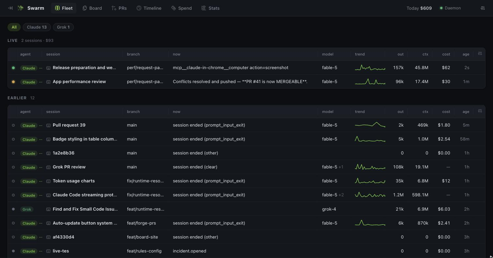
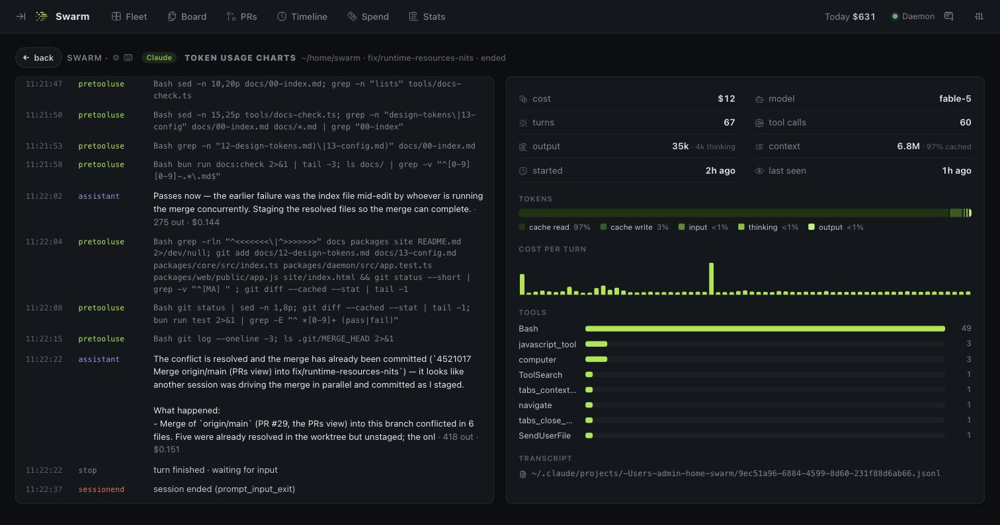
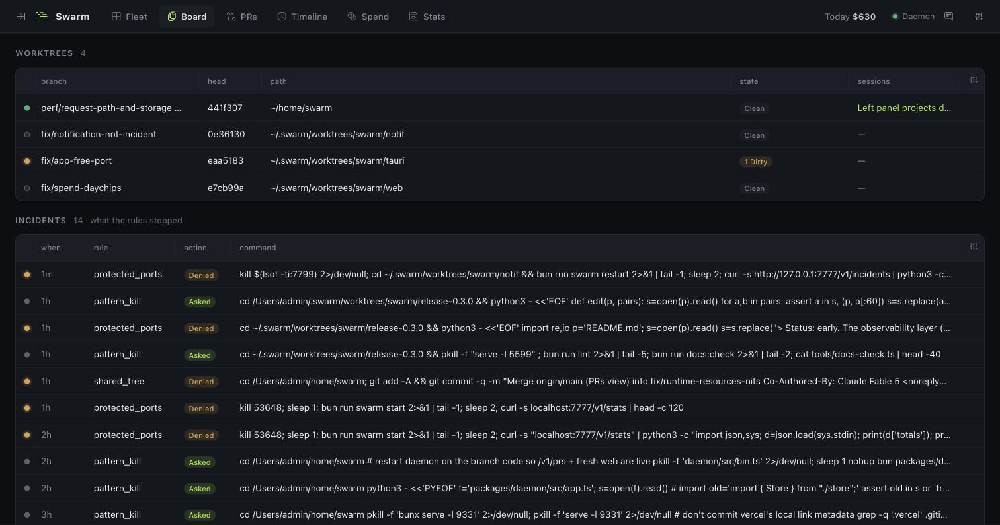
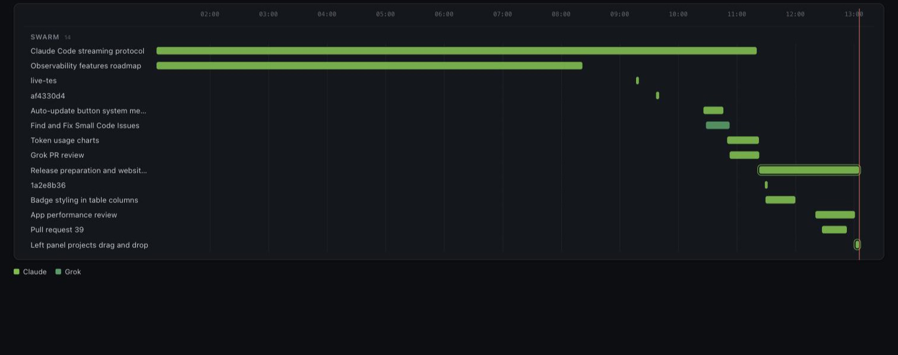
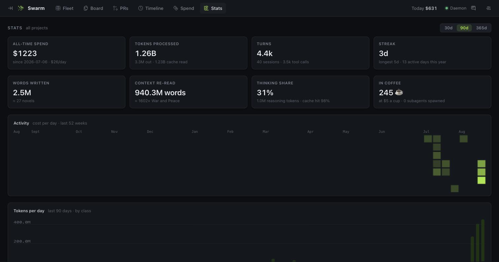

<p align="center"></p>

<h1 align="center">Swarm</h1>

<p align="center"><b>See every agent. Stop the collisions.</b><br>
A local-first control plane for AI-agent development on any repository.</p>

<p align="center">
  <a href="https://getswarm.vercel.app">Website</a> ·
  <a href="https://getswarm.vercel.app/docs/">Docs</a> ·
  <a href="https://getswarm.vercel.app/#downloads">Downloads</a> ·
  <a href="https://getswarm.vercel.app/changelog">Changelog</a> ·
  <a href="https://github.com/ra3orblade/swarm/issues/new?template=feedback.yml">Feedback</a>
</p>

<p align="center">
  <a href="https://github.com/ra3orblade/swarm/releases/latest"></a>
  <a href="https://www.npmjs.com/package/@ra3orblade/swarm"></a>
  <a href="https://github.com/ra3orblade/swarm/actions/workflows/ci.yml"></a>
  <a href="https://github.com/ra3orblade/swarm/releases"></a>
  <a href="https://www.npmjs.com/package/@ra3orblade/swarm"></a>
  <a href="LICENSE"></a>
</p>

<p align="center"><a href="https://getswarm.vercel.app"></a></p>

Run more than one [Claude Code](https://claude.com/claude-code) session at a time — or a [Codex CLI](https://github.com/openai/codex) or Grok run on the side — and you lose the thread fast: which session is on which branch, what it's costing, which worktree has uncommitted work nobody owns, why that edit got blocked. Swarm is one daemon that watches every session on your machine — live tool calls, reasoning, token spend, cost — keeps a ledger of who holds which task, worktree and runtime resource, turns the "never do X" prose in `CLAUDE.md` into real permission decisions, and streams all of it to one dashboard.

It runs entirely on your machine. No account, no telemetry, works offline. Nothing is added to your repositories.

```sh
bunx @ra3orblade/swarm setup
```

> Status: early, but real — observability, task claims, runtime resources, configurable rules, incidents and a cross-forge merge queue are built and dogfooded daily. Spawned agents and verification gates are on the [roadmap](ROADMAP.md).

---

## What you get

**Fleet** — every session across every project, live: agent, title, branch, what it's doing right now, model, a trend sparkline, output tokens, context size, cost, age. Filter by agent (Claude Code, Codex, Grok).

**Session** — an agent's reasoning and tool calls as a live stream, with cost per turn, cache hit rate, thinking share, tool histogram and the transcript path.

<p align="center"></p>

**Board** — the coordination ledger for a project: task **claims** (each in an isolated git worktree), **worktrees** with branch, dirty/unpushed state and which session is inside, **runtime resources** (ports, dev servers, databases held as named singletons), and **incidents** — every command the rules asked about or denied, with the rule and the command.

<p align="center"></p>

**Rules** — guardrails on the Bash commands a Claude Code session runs: `shared_tree`, `destructive_git`, `pattern_kill`, `protected_ports`, plus `no_foreign_worktree` and the opt-in `claim_required_to_write` on file writes; each `ask | deny | off` per repo in `.swarm.toml`. A `deny` is returned to Claude Code as a real permission denial. Ports held as resources are protected automatically. Guardrails against accidents, not a sandbox — see [what rules are and aren't](https://getswarm.vercel.app/docs/03-rules-and-config#what-rules-are--and-arent).

**PRs** — one merge queue across GitHub and GitLab, read through your already-authenticated `gh` / `glab`. Merge from the dashboard when checks and review are clear. No tokens stored.

**Timeline** — session lanes per project, coloured by agent, 3–72 h.

<p align="center"></p>

**Spend & Stats** — cost by project, model and agent, today and all-time; plus the fun numbers: tokens, turns, streaks, activity calendar, words written, what it adds up to in novels and coffee.

<p align="center"></p>

**Multi-agent** — Claude Code via its hooks and transcripts; Codex CLI and Grok by tailing the session logs they already write (`~/.codex`, ACP `updates.jsonl`). Every session is tagged with its agent; Spend breaks down per agent.

**Zero instrumentation** — it reads the hooks and transcripts the agents already write. Every table is a real data grid: sort, resize, reorder, filter, persisted layouts. Light and dark themes.

## Install

Requires [Bun](https://bun.sh) ≥ 1.3, git, and at least one agent: [Claude Code](https://claude.com/claude-code) (`claude` on your PATH — hooks, rules and MCP need it), [Codex CLI](https://github.com/openai/codex) and/or Grok (observed by tailing their logs; no hooks, so no rules). Optional: `gh` and/or `glab` (authenticated) for the PRs view.

```sh
bunx @ra3orblade/swarm setup        # daemon + hooks + MCP, opens the dashboard
```

Or install the CLI globally (`bun add -g @ra3orblade/swarm`, then `swarm setup`). Start `claude` in any folder and it appears at **http://127.0.0.1:7777**. The daemon runs in the background and auto-starts when needed; `swarm doctor` checks everything and prints the fix for each gap.

Prefer a native window with auto-updates? Get the **desktop app** from the [downloads page](https://getswarm.vercel.app/#downloads) — macOS (signed + notarized), Windows, Linux (`.deb` / `.rpm`). It bundles the daemon; run `bunx @ra3orblade/swarm install` once to add the Claude Code hooks. Building it yourself needs the Rust toolchain: `bun run desktop:dev` / `bun run desktop:build`.

Full guide: **[getswarm.vercel.app/docs](https://getswarm.vercel.app/docs/)** — [Getting started](https://getswarm.vercel.app/docs/01-getting-started) · [The dashboard](https://getswarm.vercel.app/docs/02-dashboard) · [Rules and configuration](https://getswarm.vercel.app/docs/03-rules-and-config) · [Claims and worktrees](https://getswarm.vercel.app/docs/04-claims-and-worktrees) · [Runtime resources](https://getswarm.vercel.app/docs/05-runtime-resources) · [Pull requests](https://getswarm.vercel.app/docs/06-pull-requests) · [CLI](https://getswarm.vercel.app/docs/07-cli) · [MCP](https://getswarm.vercel.app/docs/08-mcp) · [Desktop app](https://getswarm.vercel.app/docs/09-desktop-app) · [Privacy & FAQ](https://getswarm.vercel.app/docs/10-privacy-and-faq)

## Rules in 30 seconds

Drop a `.swarm.toml` in a repo (commit it — it's how the repo declares its rules). Global defaults live in `~/.swarm/config.toml`. Bad config never takes the daemon down.

```toml
[rules]                      # "ask" | "deny" | "off"
shared_tree     = "deny"     # broad `git add -A` / `commit -a` while another live session shares the checkout
destructive_git = "ask"      # reset --hard, checkout ., clean -f …
pattern_kill    = "ask"      # pkill -f and friends
protected_ports = "ask"      # freeing a port listed below (or held as a resource)
no_foreign_worktree     = "ask"  # file writes into a worktree another claim holds
claim_required_to_write = "off"  # opt-in: writes to the shared checkout need a claim

[rules.protected]
ports = [5432]
```

Every `ask` and `deny` is recorded as an incident on the Board. Reference: [Rules and configuration](https://getswarm.vercel.app/docs/03-rules-and-config).

## CLI

```sh
swarm setup                    # first-run: daemon + hooks + dashboard
swarm start | stop | restart   # manage the background daemon
swarm status                   # live sessions in the terminal
swarm doctor                   # check setup, print the fix for each gap
swarm add <path> · ls · ui     # pin a project · list projects · open the dashboard
swarm tail                     # follow the live event stream

swarm claim <task> [--owner n] # claim a task in a fresh isolated worktree (fail-closed)
swarm renew | release <task>   # extend the lease · release + remove the worktree
swarm claims · reap            # list claims · release abandoned ones (keeps those holding work)
swarm res ls | acquire <name> [--pid n] [--port n] | release <name> [--force]
swarm stats [--json]           # all-time totals, streak, records

swarm install | uninstall      # add/remove Swarm hooks in ~/.claude/settings.json
```

## For agents (MCP)

`swarm setup` registers an MCP server, so an agent can coordinate itself instead of you running the CLI:

- `swarm_status` — what's claimed, who's live, what's held in this project
- `swarm_claim` / `swarm_renew` / `swarm_release` / `swarm_reap` — task claims in isolated worktrees (fail-closed)
- `swarm_acquire_resource` / `swarm_release_resource` / `swarm_resources` — hold a port, dev server or database as a named singleton; held ports are protected from other agents automatically

## How it works

```
 Claude Code sessions ──hooks──▶ swarm-hook ──┐
 (any folder, any repo)                          │
                        transcripts (JSONL) ──────┼──▶ swarmd ──▶ SQLite (~/.swarm)
 Codex CLI  ─── ~/.codex rollout logs ────────────┤      │
 Grok       ─── ACP updates.jsonl ────────────────┘      └──▶ SSE ──▶ dashboard · CLI · MCP
                                                  ▼
                                       rules engine (ask / deny → incidents)
```

- **Identity** is the git common dir, so every worktree of a repo maps to one project.
- **State** lives in `~/.swarm/` — never in your repositories. Uninstalling leaves your repos untouched.
- **Hooks** are installed once at the Claude Code user level, so every session on the machine reports in. The hook fails open: if the daemon is down, nothing blocks your work.

Design docs (architecture, data model, protocol, interface, roadmap) are rendered at [getswarm.vercel.app/docs/design](https://getswarm.vercel.app/docs/design/) and live in [`docs/`](docs/00-index.md).

## Privacy

Everything is local. Swarm reads the hook payloads and transcript files (Claude Code, Codex, Grok) that already exist on your disk, stores derived state in `~/.swarm/swarm.db`, and serves a dashboard on `127.0.0.1`. Optional outbound paths, all under your control: fetching model prices from the public LiteLLM list (`SWARM_OFFLINE=1` skips it); the PRs view shelling out to your already-authenticated `gh` / `glab` (Swarm stores no forge tokens); and the desktop app asking GitHub Releases for updates when you click *Check for Updates…*. No data about your sessions leaves your machine.

## Configuration

| Env | Default | Meaning |
|-----|---------|---------|
| `SWARM_PORT` | `7777` | daemon port (`SWARM_PORT` > `[daemon].port` in config > `7777`) |
| `SWARM_HOME` | `~/.swarm` | state directory |
| `SWARM_URL` | derived | override the daemon URL clients use |
| `SWARM_OFFLINE` | – | `1` disables the pricing fetch |
| `SWARM_STRICT_PORT` | – | `1` fails instead of falling back to a free port |

Model prices can be overridden in `~/.swarm/pricing.json`. Full reference: [docs/13-config.md](docs/13-config.md).

## Contributing

Issues and PRs welcome — see [CONTRIBUTING.md](CONTRIBUTING.md), the [roadmap](ROADMAP.md) and the [changelog](CHANGELOG.md). Found something confusing? Use the **Feedback** button in the dashboard or [open an issue](https://github.com/ra3orblade/swarm/issues/new/choose). By participating you agree to the [Code of Conduct](CODE_OF_CONDUCT.md).

```sh
git clone https://github.com/ra3orblade/swarm.git && cd swarm && bun install
bun run dev      # daemon with hot reload
bun run test     # the suite CI runs
```

Apache-2.0.
